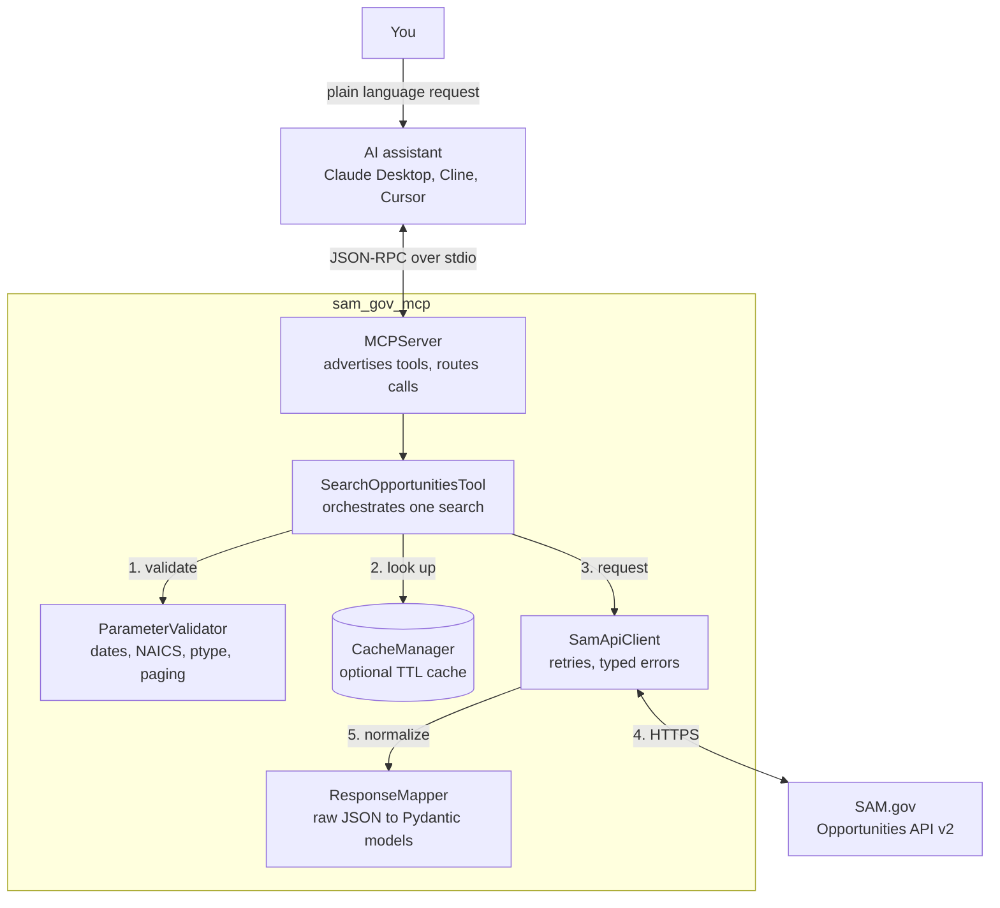
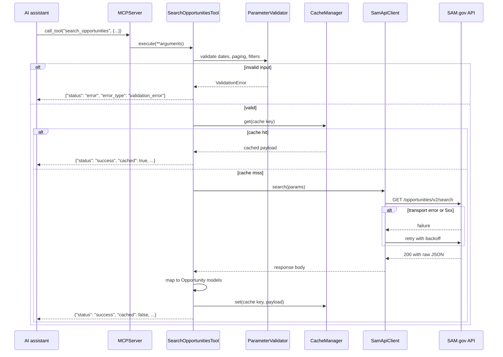

# SAM.gov Opportunities MCP Server

[](https://github.com/44r0nd4vidg3/sam_gov_mcp/actions/workflows/ci.yml)
[](https://www.python.org/downloads/)
[](LICENSE)

Search federal contract opportunities from an AI assistant, in plain language.

This is a [Model Context Protocol](https://modelcontextprotocol.io) server for the
[SAM.gov Get Opportunities Public API (v2)](https://open.gsa.gov/api/get-opportunities-public-api/).
Connect it to Claude Desktop, Cline, Cursor, or any MCP client and ask for
what you are looking for:

> *Find active 8(a) set-aside solicitations in NAICS 541511 posted since January.*

The assistant translates that into a validated SAM.gov query, and gets back
normalized JSON — titles, solicitation numbers, agencies, points of contact,
award details, and direct SAM.gov links.

> **Unofficial.** Not affiliated with, or endorsed by, GSA or SAM.gov.

## Why this exists

SAM.gov publishes every federal procurement notice, and the public API is
free. It is also awkward to use directly: dates must be `MM/dd/yyyy`, the
range cannot exceed a year, filters are cryptic single letters, the key
travels as a query parameter, and the JSON is deeply nested with fields that
change name between notice types.

That is exactly the kind of friction an MCP server should absorb. This one
handles the format rules, validates parameters before spending a request,
normalizes the response into a stable shape, and returns errors an assistant
can actually act on — so the person asking can think about opportunities
rather than about date formats.

## How it works



Each piece has one job, which is what makes the server testable without
touching the network:

| Component | Responsibility |
|---|---|
| `server.py` | Speaks MCP: advertises tools, routes calls, owns the stdio transport |
| `tools/search.py` | Orchestrates one search and shapes the result envelope |
| `validators.py` | Rejects bad input before a request is spent |
| `api_client.py` | HTTP, retries, and mapping status codes to typed errors |
| `response_mapper.py` | Turns SAM.gov's nested JSON into stable Pydantic models |
| `cache.py` | Optional in-memory TTL cache keyed on the request |
| `config.py` | Settings from the environment or `.env` |

### A single search, end to end



Note where the errors go. A validation failure never reaches SAM.gov, and no
failure is raised across the MCP boundary — every outcome comes back as a
JSON envelope the assistant can read and explain.

## Quick start

### 1. Check your Python

You need **Python 3.10 or newer** and **pip 21.3 or newer** (editable installs
of a `pyproject.toml` project need PEP 660 support).

```bash
python3 --version        # macOS / Linux
py --version             # Windows
```

If that is older than 3.10, install a newer Python however your platform
prefers — python.org installers, your distribution's package manager, pyenv,
uv, Homebrew. This project has no opinion about which; it only needs
`python -V` inside the virtual environment to report 3.10 or newer.

If you have several versions installed, name the one you want explicitly:

```bash
for v in 3.14 3.13 3.12 3.11 3.10; do command -v python$v; done
```

### 2. Install

```bash
git clone https://github.com/44r0nd4vidg3/sam_gov_mcp.git
cd sam_gov_mcp

python3 -m venv .venv                 # or python3.12 -m venv .venv
source .venv/bin/activate             # Windows: .venv\Scripts\activate

python -m pip install --upgrade pip
python -m pip install -e .
```

Confirm it works before going further:

```bash
python scripts/smoke_test.py
```

That launches the server exactly as an MCP client does and completes a real
protocol handshake. It needs no API key and no network access. If it fails
here, no amount of client configuration will help.

### 3. Get an API key

Sign in at [sam.gov](https://sam.gov), open **Account Details**, and request a
public API key. It is free. Keys are rate limited per day, so treat one like
a password.

### 4. Connect it to your assistant

For **Claude Desktop**, this server is added through the config file, not
through the Connectors UI. "Custom connectors" in the Claude window are for
**remote** MCP servers reached over HTTP — this one speaks stdio, so it is
launched by the app as a subprocess instead.

Open the **Claude menu in your operating system's menu bar** (not the settings
inside the Claude window) → **Settings…** → **Developer** → **Edit Config**.
That opens:

- macOS: `~/Library/Application Support/Claude/claude_desktop_config.json`
- Linux: `~/.config/Claude/claude_desktop_config.json`
- Windows: `%APPDATA%\Claude\claude_desktop_config.json`

```json
{
  "mcpServers": {
    "sam-gov": {
      "command": "/absolute/path/to/sam_gov_mcp/.venv/bin/python",
      "args": ["-m", "sam_gov_mcp"],
      "env": {
        "SAM_API_KEY": "your_actual_api_key_here"
      }
    }
  }
}
```

Use an **absolute path** to the interpreter you installed into — on Windows
that is `...\\.venv\\Scripts\\python.exe`, with backslashes escaped in JSON.
Claude Desktop does not inherit your shell's `PATH` or your active
virtualenv, and a bare `python` is the most common reason a server shows up
with no tools. `source .venv/bin/activate && which python` prints the exact
string to paste (`where python` on Windows).

Quit Claude Desktop completely and reopen it — a window reload will not pick
up the change.

Cline, Cursor, and Continue take the same `command` / `args` / `env` shape.

If the server does not appear, its stderr is captured here:

```bash
tail -n 40 -f ~/Library/Logs/Claude/mcp-server-sam-gov.log
```

### 5. Ask for something

```
Find active solicitations posted between January 1 and March 31, 2024
Search 8(a) set-aside opportunities in NAICS 236115 from Q1 2024
Any combined synopsis notices for IT services in the last 60 days?
Get the next page of those results
```

## Using the tool

### `search_opportunities`

| Parameter | Required | Description |
|---|---|---|
| `posted_from` | yes | Start date, `MM/dd/yyyy` |
| `posted_to` | yes | End date, `MM/dd/yyyy` |
| `limit` | no | Records per page, 1–1000 (default 10) |
| `offset` | no | Page offset (default 0) |
| `ptype` | no | Procurement type — see below |
| `ncode` | no | NAICS code, 1–6 digits |
| `status` | no | `active`, `inactive`, `archived`, `cancelled`, `deleted` |
| `type_of_set_aside` | no | `SBA`, `8A`, `WOSB`, `HUBZONE`, `VOSB`, `SDVOSB` |
| `title` | no | Match against the opportunity title |

Procurement types: `u` justification, `o` solicitation, `a` award notice,
`k` combined synopsis/solicitation, `s` special notice, `p` presolicitation.

The date range cannot exceed one year. That is a SAM.gov constraint, checked
before the request is sent so you do not spend a call on it.

`title` matches the opportunity title only. SAM.gov v2 offers no full-text
search over descriptions or attachments, so the practical way to narrow by
subject is the NAICS code — `541511` for custom programming, `541512` for
systems design.

### What comes back

```json
{
  "status": "success",
  "cached": false,
  "data": {
    "pagination": { "total_records": 42, "limit": 10, "offset": 0 },
    "opportunities": [
      {
        "id": "a1b2c3d4e5f6",
        "title": "Custom Computer Programming Services",
        "solicitation_number": "W912DY-24-R-0001",
        "posted_date": "2024-01-02T00:00:00",
        "description": "https://api.sam.gov/.../description",
        "agency": "DEPT OF DEFENSE",
        "status": "active",
        "naics_code": "541511",
        "set_aside_type": "Total Small Business Set-Aside",
        "ui_link": "https://sam.gov/opp/a1b2c3d4e5f6/view",
        "contact_info": [
          { "type": "primary", "name": "Jane Doe", "email": "jane.doe@example.gov" }
        ],
        "award_info": null
      }
    ]
  }
}
```

`description` is a **URL**, not prose. Fetching it requires appending your API
key, and this server deliberately does not do that: tool output is handed to a
language model and ends up in transcripts and logs, which is no place for a
credential. Fetch it server-side if you need the text, or use the
[simple example server](examples/simple_server.py), which retrieves and cleans
it before returning.

### When something goes wrong

Errors come back in the same envelope, so the assistant can explain them
instead of just failing:

```json
{
  "status": "error",
  "error_type": "validation_error",
  "message": "Date range cannot exceed 365 days. Your range: 730 days"
}
```

`error_type` is `validation_error`, `api_error`, or `unexpected_error`.
Internally, HTTP statuses map to typed exceptions — 401/403
`AuthenticationError`, 400 `BadRequestError`, 404 `NotFoundError`, 429
rate-limit `APIError`, 5xx `ServerError` — and transport failures and 5xx
responses are retried with exponential backoff.

## Configuration

Settings come from the environment, or from a `.env` file in the working
directory. Copy `.env.example` to `.env` to start.

| Variable | Default | Description |
|---|---|---|
| `SAM_API_KEY` | — | **Required.** Your SAM.gov public API key |
| `SAM_API_URL` | production search URL | Override the endpoint |
| `SAM_ENVIRONMENT` | `production` | `production` or `alpha` |
| `SAM_TIMEOUT` | `30` | Request timeout in seconds |
| `SAM_MAX_RETRIES` | `3` | Attempts for transport and 5xx failures |
| `MCP_SERVER_LOG_LEVEL` | `INFO` | `DEBUG`, `INFO`, `WARNING`, `ERROR` |
| `MCP_SERVER_DEBUG` | `False` | Debug mode |
| `CACHE_ENABLED` | `False` | Enable the in-memory cache |
| `CACHE_TTL` | `3600` | Cache lifetime in seconds |
| `CACHE_TYPE` | `memory` | `memory` or `none` |

There is no host or port setting. The server uses the stdio transport: your
MCP client launches the process and talks to it over a pipe.

`.env` is read from the current working directory, and an MCP client launches
the server from its own directory — so for client use, put the key in the
config's `env` block rather than relying on `.env`.

With `CACHE_ENABLED=True`, identical searches inside the TTL are served from
memory and the response carries `"cached": true`. The cache lives in the
server process and is lost on restart.

## Two servers

| | `src/sam_gov_mcp/` | `examples/simple_server.py` |
|---|---|---|
| Structure | modular, typed, tested | one file, ~150 lines |
| Descriptions | returns the URL | fetches and cleans the text |
| Caching | optional TTL cache | none |
| Config | `.env` or environment | `SAM_API_KEY` only |
| Use it for | everything | reading, and quick experiments |

The package is the real project. The example is kept because its inline
description fetching is genuinely useful and it is a readable introduction to
the API — but it issues one extra call per result, throttled to two at a
time, so large `limit` values are slow enough to hit client timeouts.

## Development

```bash
pip install -e ".[dev]"

pytest                       # full suite, no network or API key needed
pytest --cov=sam_gov_mcp     # with coverage
ruff check .                 # lint
python scripts/smoke_test.py # start the server and complete a real handshake
```

`scripts/smoke_test.py` is the honest test: it launches the server as a
subprocess exactly as an MCP client would, completes the protocol handshake,
lists the tools, and makes a tool call. CI runs it against a **non-editable**
install, so a subpackage missing from the wheel cannot hide behind the source
tree on `sys.path`.

### Layout

```
src/sam_gov_mcp/
├── __main__.py          # entry point, stdio transport
├── server.py            # MCP protocol handlers
├── tools/
│   ├── base.py          # BaseTool contract
│   └── search.py        # search_opportunities
├── api_client.py        # HTTP, retries, typed errors
├── response_mapper.py   # raw JSON to models
├── validators.py        # parameter validation
├── models.py            # Pydantic models
├── cache.py             # TTL cache
├── config.py            # settings
└── errors.py            # exception hierarchy

tests/                   # 55 tests, all offline
examples/simple_server.py
scripts/smoke_test.py
```

The `src/` layout is deliberate: it makes an editable install behave like a
real one, so packaging mistakes surface in development instead of in
someone else's `pip install`.

### Adding a tool

1. Add a module under `src/sam_gov_mcp/tools/`.
2. Subclass `BaseTool`; implement `name`, `description`, `input_schema`, `execute`.
3. Export it from `tools/__init__.py` and register it in `MCPServer.tools`.
4. Add tests.

```python
from sam_gov_mcp.tools.base import BaseTool


class MyTool(BaseTool):
    @property
    def name(self) -> str:
        return "my_tool"

    @property
    def description(self) -> str:
        return "What this tool does."

    @property
    def input_schema(self) -> dict:
        return {"type": "object", "properties": {}, "required": []}

    async def execute(self, **kwargs) -> dict:
        return {"status": "success", "data": {}}
```

See [CONTRIBUTING.md](CONTRIBUTING.md) for the full workflow.

## Troubleshooting

**Server dies immediately with `PermissionError: [Errno 1] Operation not
permitted` on `pyvenv.cfg`** (macOS). Not a file-permission problem — macOS
gates `~/Documents`, `~/Desktop`, and `~/Downloads` per application. Claude
Desktop lacks access, and the Python subprocess it launches inherits that
denial, so a correct path to a working interpreter still fails. The same
command succeeds in your terminal, which has the permission. Either keep the
project outside those folders (`~/Projects/sam_gov_mcp`) or grant access in
System Settings → Privacy & Security → Files and Folders. Moving it is the
sturdier fix. Recreate the virtual environment after moving — `pyvenv.cfg`
and the activate scripts hold absolute paths.

**No tools appear in the client.** Run the exact command from your config by
hand. Nearly always a wrong interpreter path or a missing `SAM_API_KEY`.
Errors go to stderr, which your client's MCP log captures
(`~/Library/Logs/Claude/mcp-server-<name>.log` on macOS).

**The server is not in the Connectors list.** Custom connectors are remote
MCP servers only. A stdio server like this one is registered in
`claude_desktop_config.json` via Settings → Developer → Edit Config, and
appears after a full restart.

**`ValidationError: api_key Field required`.** `SAM_API_KEY` is not in the
process environment and no `.env` was found in the working directory. Put the
key in the client config's `env` block.

**`AuthenticationError: invalid or missing API key`.** The key was rejected.
Production and alpha keys are not interchangeable — check `SAM_ENVIRONMENT`.

**`Date range cannot exceed 365 days`.** A SAM.gov limit. Narrow the range.

**Rate limited.** SAM.gov enforces a daily per-key quota. Set
`CACHE_ENABLED=True` so repeated searches do not spend calls.

## Status and roadmap

Alpha. One tool ships and is covered by tests. Response field mappings are
written against the published v2 schema with fallbacks for older field names;
if something comes back null that should not, please
[open an issue](https://github.com/44r0nd4vidg3/sam_gov_mcp/issues) with the
raw payload.

- [ ] Support mcp 2.0, which replaced the low-level server's decorator API
      with constructor handlers and renamed FastMCP to MCPServer. The
      dependency is pinned to `mcp>=1.27.0,<2.0.0` until that migration is
      done and verified.
- [ ] Optional server-side description fetching in the package
- [ ] A details tool, once it returns more than search already does
- [ ] Verify mappings against live payloads across every notice type
- [ ] Persistent cache backend for multi-session use

## Contributing

Issues and pull requests are welcome — see [CONTRIBUTING.md](CONTRIBUTING.md).
Good first contributions are listed in the roadmap above.

## License

MIT — see [LICENSE](LICENSE).
